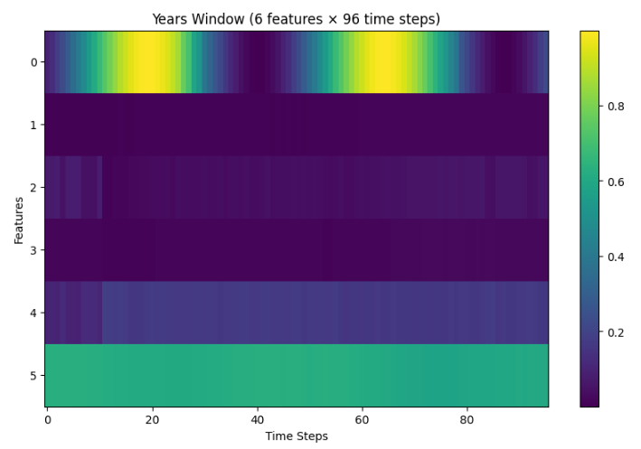
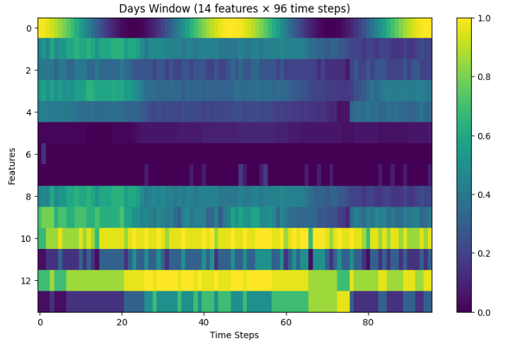
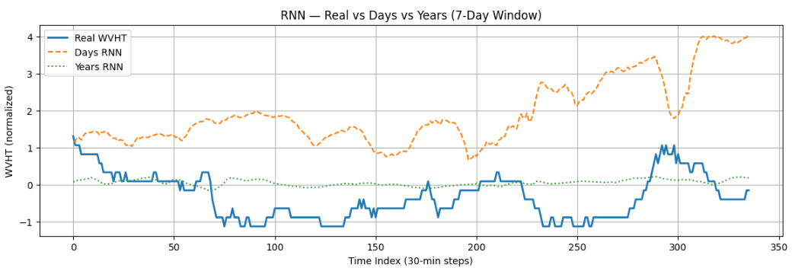
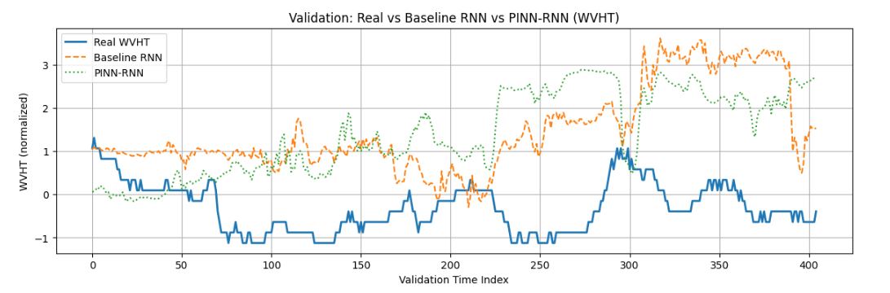
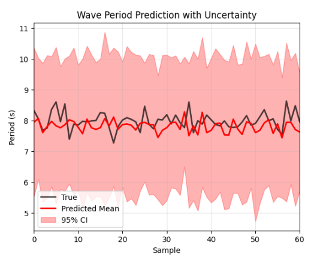

# Stochastic PINN - LH

### Data Structures
data/
├── days45/
├── processed/
├── years10/
├── df_AS_norm.csv
├── df_days_norm.csv
├── df_years_norm.csv
└── update_data.ipynb
models/
├── base_model.ipynb
├── CNN.ipynb
├── MLP_Multi_Target.ipynb
├── MLP_One_Target.ipynb
├── RNN.ipynb
├── PINN_RNN.ipynb
└── Stochastic_PINN_RNN.ipynb

### Description of the Project
- Create something that can combined physics and computer science (deep learning)
- Ended up making a PINN (Physics Informed Neural Network)
- i.e. physics functions combined with neural networks or other ML models to make them more realistic via equations
- Started by determining what type of project I wanted to do (ocean wave prediction)
- The single target parameter is Wave Height, using data off the coast of Wilmington, North Carolina
- I found that there are a few other people/groups that are doing this type of work
- However, I wanted to do something a bit niche and I wanted to make it more interesting.
- So, I included stochastic properties into the model
- As a result, I made a stochastic physics informed neural network based on a recurrent neural network
- My work predicts wave height 3 days into the future!
- As a comparison, I made a few other models (found in the models section of teh data structures)

### Instructions
- Setting up the data, libraries, directories, initialization
  - Colab / local initialization
  - Import required libraries
  - Load and preprocess NDBC buoy data
  - Normalize variables
  - Define time domain and make "window slides" as forms of data
- Model A (Deterministic PINN – Baseline)
  - Create training data
  - Define neural network
  - Define physics loss (linear wave equation)
  - Total loss = data loss + physics loss
  - Train model
  - Plot the loss plots and plot against true data
  - Save model and plots!
- Model B (Stochastic PINN)
  - Start from deterministic PINN
  - Randomize initial conditions
  - Add Gaussian noise term to physics loss
  - Train stochastic model
  - Track mean prediction behavior + uncertainty
  - Save model and plots!

- Results
  - Compare deterministic PINN vs stochastic PINN and other models (that did far worse)
  - Plot predictions vs buoy data  

### Window Slides
10 year data that has 6 features    
   
10 year data that has 14 features  
   

### Physics Informed Neural Network & Baseline RNN
Comparing "Days" vs "Years" Models
   
PINN vs Baseline RNN vs True Data (Wave Height) 
 

### Stochastic - Physics Informed Neural Network
Stochastic Model vs True Data (Wave Period Prediction)   
  
Stochastic Model vs True Data (Wave Height Prediction) 

### References
1. **National Data Buoy Center (NDBC)**  
   *Station 41038 (Buoy 41038).*  
   NOAA.  
   Available at: https://www.ndbc.noaa.gov/station_page.php?station=41038  
   Accessed: Oct. 4, 2025.

2. **National Data Buoy Center (NDBC)**  
   *Station 41110 (ILM2) – Masonboro Inlet, NC.*  
   NOAA.  
   Available at: https://www.ndbc.noaa.gov/station_page.php?station=41110  
   Accessed: Oct. 4, 2025.

3. **National Data Buoy Center (NDBC)**  
   *Station 51214 – King-Poloa, American Samoa.*  
   NOAA.  
   Available at: https://www.ndbc.noaa.gov/station_realtime.php?station=51214  
   Accessed: Dec. 11, 2024.

4. **Lawal, Z. K., Yassin, H., Lai, D. T. C., & Idris, A. C.**  
   *Modeling the complex spatio-temporal dynamics of ocean wave parameters: A hybrid PINN-LSTM approach for accurate wave forecasting.*  
   Measurement, vol. 252, p. 117383, 2025.  
   DOI: https://doi.org/10.1016/j.measurement.2025.117383

5. **Wang, Q., Liu, Y., Shi, Y., & Hua, S.**  
   *Adjusting Soil Temperatures with a Physics-Informed Deep Learning Model for a High-Resolution Numerical Weather Prediction System.*  
   Atmosphere, vol. 16, no. 2, p. 207, 2025.  
   DOI: https://doi.org/10.3390/atmos16020207

6. **Mathias, M. S., et al.**  
   *A Physics-Informed Neural Operator for the Simulation of Surface Waves.*  
   Journal of Offshore Mechanics and Arctic Engineering, vol. 146, no. 6, p. 061201, 2024.

